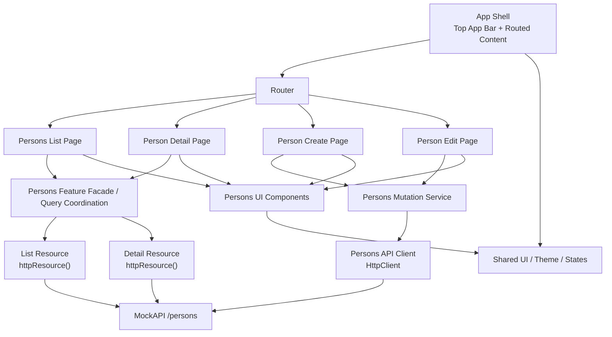

# Angular Architecture

## Context

`People Directory` is an Angular 21 application backed by MockAPI at:
[MockAPI persons](https://69ca6329ba5984c44bf30fe2.mockapi.io/api/v1/persons)

The V1 scope is a focused CRUD application around `persons` with:
- list
- detail
- create
- update
- delete
- server-side search
- server-side sorting
- server-side pagination
- loading, empty, error, and not-found states

The goal of this document is to define what the Angular application should look like architecturally before implementation begins.

## Architectural Principles

- Prefer Angular 21 standalone APIs throughout the application.
- Keep the architecture feature-first and delivery-oriented.
- Use simple boundaries with clear responsibilities over abstract layering.
- Keep read flows and mutation flows explicit because they use different Angular HTTP patterns.
- Favor local, route-scoped state before introducing heavier application-wide state patterns.
- Build a structure that is easy to extend in V2 without over-engineering V1.
- Preserve accessibility and UI consistency as architectural concerns, not just implementation polish.

## Recommended Angular 21 Approach

### Core framework stance

- Use standalone bootstrapping.
- Use `provideRouter` for application routing.
- Use lazy loading at the feature page boundary.
- Use `inject()` consistently instead of constructor injection where practical.
- Use `ChangeDetectionStrategy.OnPush` on page and UI components.
- Use signals for local component state and view-facing query state.

### Stable versus experimental APIs

- Use stable Angular APIs by default.
- Do not use Signal Forms in V1.
- Use `httpResource()` only where it is a strong fit: route-facing read models such as list and detail.
- Keep `HttpClient` for imperative mutations: create, update, delete.

This split is the recommended compromise between modern Angular 21 patterns and predictable CRUD behavior.

## Architecture Overview



## Recommended High-Level Architecture

The application should be organized into three main layers of responsibility:

- `core`
  - application shell
  - global providers and configuration
  - top-level layout
  - routing bootstrap concerns
- `shared`
  - reusable UI building blocks
  - formatting helpers
  - common view primitives used across multiple features
- `features/persons`
  - all domain-specific logic, UI, routes, models, and data access for persons

The key architectural decision is to keep the application feature-first, with the `persons` feature acting as the main delivery unit for V1.

## Enterprise-Oriented Interpretation

Even though the V1 scope is intentionally focused, the architecture should be shaped so it can evolve cleanly under more demanding conditions.

This means:
- the structure should tolerate additional features without a major rewrite
- responsibilities should be explicit enough to support onboarding and code reviews
- route, state, and data boundaries should remain understandable as the app grows
- cross-cutting concerns should have clear homes instead of being scattered through pages

For this project, "more enterprise" should not mean "more layers everywhere". It should mean:
- stronger naming and folder conventions
- clearer ownership of read versus mutation behavior
- reusable UX state patterns
- disciplined feature boundaries
- predictable integration points for logging, analytics, auth, or future shared platform concerns

## Architectural Principles for Team Scalability

- Make route containers orchestration-focused and keep view primitives below them.
- Keep domain types and API contracts close to the feature that owns them.
- Centralize repeated interaction patterns such as snackbar usage, loading state rendering, and not-found handling.
- Keep API integration narrow and typed so backend changes do not ripple through every page.
- Prefer composition over inheritance or framework-heavy abstractions.
- Keep the architecture simple enough that a second team member can navigate it quickly.

## Application Structure

Recommended structure:

```text
src/app/
  core/
    layout/
    config/
    navigation/
  shared/
    ui/
    pipes/
    utils/
  features/
    persons/
      data/
      model/
      pages/
      ui/
```

### `core`

`core` should contain application-wide pieces that should exist only once.

Recommended responsibilities:
- root shell component
- top app bar
- app title and navigation entry points
- top-level provider configuration
- global HTTP/provider wiring if needed
- future integration points for auth/session concerns
- future integration points for app-wide telemetry or diagnostics

`core` should not contain persons-specific logic.

### `shared`

`shared` should contain reusable, presentation-oriented assets that are not tied to the persons domain.

Good candidates:
- generic loading state component
- generic empty state component
- generic error state component
- shared date formatting pipe if needed
- layout utilities and small UI helpers
- shared dialog patterns if more than one feature uses them later
- shared notification helpers if they become app-wide

Avoid placing feature-specific components in `shared` too early.

### `features/persons`

This feature owns the full domain slice for V1.

Recommended internal boundaries:
- `data`
  - API access
  - resource creation
  - mutation services/facades
  - query state coordination
- `model`
  - domain types
  - form payload types
  - query parameter types
  - mapping helpers if needed
- `pages`
  - route-level containers for list, detail, create, and edit
- `ui`
  - feature-local presentational components such as person form, person avatar, detail metadata card, and list toolbar

This structure also gives the project a clean path if a future V2 introduces more domains such as groups, organizations, permissions, or audit history.

This structure keeps route orchestration, domain logic, and UI composition separate without becoming excessively layered.

## Feature Boundaries

For V1, the dominant feature boundary is the `persons` domain. That is the correct level of decomposition because:
- all user-facing flows belong to one business entity
- the routing model is entity-centered
- the API surface is centered on one resource
- the CRUD flows share types, validation rules, and UI primitives

The application does not currently justify splitting into multiple independent business features.

Within `persons`, the route-level boundaries should be:
- persons list page
- person detail page
- person create page
- person edit page

These should share domain and UI building blocks while remaining separate route containers.

## Routing Strategy

Recommended routes:
- `/persons`
- `/persons/new`
- `/persons/:id`
- `/persons/:id/edit`

### Routing design rationale

- `/persons` is the primary landing page and browsing surface.
- `/persons/new` isolates creation from editing and avoids overloading one page mode.
- `/persons/:id` is the canonical read-only reference page for a person.
- `/persons/:id/edit` keeps edit mode explicit and easy to navigate to from detail.

### Lazy loading

Use lazy loading at the page boundary. Even though the app is small, this keeps the route structure aligned with modern Angular practice and avoids binding all screens into a monolithic root component.

### Not-found behavior

`/persons/:id` and `/persons/:id/edit` should both support an explicit not-found state when the backend returns no entity.

This state should be treated as a first-class route result, not as a console-only or raw HTTP failure.

## State and Data Flow

### State philosophy

Use local state and feature-scoped state rather than a global store.

The app does not currently require NgRx or a centralized application-wide state container. The complexity is better handled by:
- signals for UI and query state
- `httpResource()` for read-oriented remote state
- `HttpClient` plus explicit refresh flows for mutations

### List flow

The persons list page should own:
- search term
- sort field
- sort order
- page index
- page size

These values form the list query state. They should feed a read model that maps directly to the MockAPI query parameters:
- `search`
- `sortBy`
- `order`
- `page`
- `limit`

The page container should manage these values through signals and drive the list read resource from them.

### Detail flow

The detail page should derive its read state from the route `id` and use a dedicated detail read resource.

This keeps detail loading independent of the list page and makes direct navigation to `/persons/:id` a first-class flow.

### Mutation flow

Create, update, and delete should be handled imperatively through `HttpClient`.

This is the recommended pattern because mutations need:
- explicit submit lifecycle
- disabled button states
- snackbar feedback
- navigation after success
- controlled refresh of affected read models

### Enterprise recommendation on orchestration

For V1, a light feature facade is recommended inside `features/persons/data`.

Its purpose is not to become a generic store, but to:
- keep page components small
- centralize query parameter state
- encapsulate refresh triggers after mutations
- provide a single orchestration surface for list/detail route containers

This gives the codebase better long-term maintainability without paying the cost of a full state-management framework.

### Refresh strategy

The architecture should include an explicit refresh mechanism for resource-backed reads after mutations.

Recommended behavior:
- after create: navigate to the created person detail and allow the detail read model to resolve from route state
- after update: navigate back to detail and refresh that detail read model
- after delete: refresh the list read model and navigate away from detail if necessary

This should be handled by feature-level coordination rather than hidden implicit coupling.

## Recommended Data Access Shape

Inside `features/persons/data`, separate responsibilities clearly:

- read resource builders
  - list resource
  - detail resource
- mutation API service
  - create person
  - update person
  - delete person
- optional feature facade
  - centralize query state and refresh coordination if that improves page simplicity

This is a good place for a light facade pattern, but only if it simplifies the page containers. The facade should remain thin and focused on feature orchestration, not become a generic store abstraction.

## Forms and Validation Strategy

Use Reactive Forms for V1.

Signal Forms should be explicitly deferred to V2 because the project already decided to stay pragmatic with experimental APIs.

### Form architecture

Recommended approach:
- one reusable `PersonForm` UI component inside `features/persons/ui`
- one route container for create
- one route container for edit

The reusable form should own:
- form controls
- validation messages
- local submission-disabled state passed from the page or mutation flow
- normalized output payload

The route pages should own:
- mode-specific titles and submit text
- initial data loading for edit
- API submission
- success navigation

This separation is particularly important in a team setting because it prevents form rendering concerns and route orchestration concerns from collapsing into one oversized component.

### Validation rules

The architecture should preserve these validation rules:
- `firstName`: required, max `30`
- `lastName`: required, max `30`
- `email`: required, valid email, max `60`
- `birthDate`: required, valid date, not in the future
- `phone`: required, max `30`
- `avatar`: required, valid URL, max `256`

Text normalization such as trimming should happen at the form boundary before submit.

## UI Composition Strategy

### Global shell

The root shell should be intentionally simple:
- top app bar
- application title `People Directory`
- primary content region with centered max width

No side navigation is needed in V1 because the application revolves around one feature boundary.

However, the shell should still be designed so a future navigation extension is possible without reworking the whole root layout.

### List page composition

The list page should be composed from:
- page header
- search control
- table region
- paginator region
- shared state blocks for loading, empty, and error

Feature-local UI components may include:
- persons list toolbar
- avatar cell renderer
- actions cell renderer

### Detail page composition

The detail page should be composed from:
- page header with title and actions
- primary identity block with avatar and person summary
- information section for email, phone, birth date
- secondary metadata section for `id`, `created_at`, `updated_at`

### Avatar strategy

Avatar display is a cross-page feature-local concern and should be encapsulated in a reusable persons UI component.

This component should support:
- remote image display
- initials fallback
- accessible labeling

## Error, Loading, Empty, and Not-Found Handling

These states should be treated as architectural behaviors, not one-off template cases.

### Loading

The application should support:
- route-level loading for list and detail reads
- submit-level loading for create, update, and delete

### Empty

The list page should explicitly represent the case where no persons match the current server-side search/filter state.

### Error

Errors should be rendered as user-facing states or snackbar messages depending on context:
- page-level fetch failures: inline error state
- mutation failures: snackbar plus preserved page context

From an enterprise perspective, this should become a documented interaction rule so future features behave consistently.

### Not found

Not found is a distinct route-level state for detail and edit pages and should not be conflated with generic error handling.

## Accessibility Considerations

The architecture should assume WCAG AA as a non-functional requirement.

Architectural implications:
- choose Material primitives that already support accessible semantics well
- keep form validation messages explicit and associated with controls
- ensure keyboard access to table actions and dialogs
- maintain visible focus states in the custom theme layer
- treat accessible alt text and avatar fallback as part of component design

Accessibility should be preserved through shared primitives and component contracts, not added only at the end.

## Date and Formatting Strategy

Formatting requirements already agreed:
- `birthDate` displayed as local `dd/MM/yyyy`
- `created_at` and `updated_at` displayed as local date and time

This suggests a formatting boundary in the UI layer rather than at the API layer. Raw API values should remain close to their backend representation in the data/model layer, while user-facing formatting should happen in components or shared presentation utilities.

## Cross-Cutting Concerns

### Theming

The app should use Angular Material with a light Material 3 base and a light custom CSS layer.

The architecture should keep theme concerns centralized and avoid feature-level ad hoc styling systems.

### Observability readiness

V1 does not need a full observability stack, but the architecture should leave clean insertion points for:
- HTTP logging/interceptors
- analytics events on key flows
- mutation success/failure monitoring
- future error reporting hooks

These concerns belong in `core` and should not be embedded directly in feature UI components.

### Delivery governance readiness

The existing GitHub feature issues already define an implementation order. The architecture should support slicing work along those issue boundaries without creating cross-cutting churn on every ticket.

### Notifications

Snackbar feedback should be treated as a shared interaction service or shared usage pattern, not repeatedly invented per page.

### Repository evolution

The current repository is still light. This architecture deliberately prepares the project for implementation without forcing a heavyweight platform structure too early.

## Alternatives Considered

### Global store

A full global store solution was not selected because the current application scope is a single CRUD domain with manageable local and route-scoped state.

### Client-side filtering and pagination

This was not selected because MockAPI already supports server-side search, sort, and pagination, and the product direction prefers using backend capabilities from the start.

### Signal Forms in V1

This was not selected because the project explicitly chose a more stable Angular 21 baseline for forms in the first release.

### Sidenav layout

This was not selected because it adds structural weight without improving the core user flows for a one-feature V1.

## Alignment with Existing GitHub Feature Issues

The architecture maps cleanly to the issues already created in GitHub:

- [#1 F01 - App Shell and Routing](https://github.com/pato909/mock-api-angular-21/issues/1)
  - covered by the `core` shell, routing strategy, and application structure sections
- [#10 F02 - Material Theme and Shared UI Foundations](https://github.com/pato909/mock-api-angular-21/issues/10)
  - covered by the theming, shared UI, and cross-cutting concerns sections
- [#9 F03 - Persons Domain Model and Data Access Layer](https://github.com/pato909/mock-api-angular-21/issues/9)
  - covered by the feature structure, model boundaries, and read/mutation data strategy
- [#11 F04 - Persons List Page with Server-Side Search, Sort, and Pagination](https://github.com/pato909/mock-api-angular-21/issues/11)
  - covered by the routing, state, data flow, and list composition sections
- [#8 F05 - Person Detail Page](https://github.com/pato909/mock-api-angular-21/issues/8)
  - covered by the detail route and UI composition sections
- [#5 F06 - Person Create Form](https://github.com/pato909/mock-api-angular-21/issues/5)
  - covered by the forms and validation strategy
- [#7 F07 - Person Edit Form](https://github.com/pato909/mock-api-angular-21/issues/7)
  - covered by the forms, edit orchestration, and not-found behavior sections
- [#6 F08 - Delete Confirmation and Mutation Feedback](https://github.com/pato909/mock-api-angular-21/issues/6)
  - covered by the mutation flow and user feedback architecture
- [#2 F09 - Avatar Fallback and Display Robustness](https://github.com/pato909/mock-api-angular-21/issues/2)
  - covered by the avatar strategy and reusable persons UI component guidance
- [#3 F10 - Loading, Empty, Error, and Not-Found Polish](https://github.com/pato909/mock-api-angular-21/issues/3)
  - covered by the shared state-handling and non-happy-path architecture
- [#4 F11 - Accessibility and Interaction Pass](https://github.com/pato909/mock-api-angular-21/issues/4)
  - covered by the accessibility and interaction rules embedded across the architecture

This means the current GitHub backlog is already aligned with the architecture and can be used as the implementation breakdown without redefining the design.

## Risks

- `httpResource()` may prove excellent for reads but uneven for broader orchestration, which is why its use is intentionally bounded.
- Angular Material can feel generic if the custom theme layer is too weak.
- Without tests in V1, architectural clarity and separation become even more important.
- No unsaved-changes guard means form abandonment is tolerated in V1 and should remain an explicit product choice.
- External avatar URLs can fail and must not leak broken presentation into list and detail pages.

## Deferred Decisions

These are intentionally left open for the implementation phase:
- exact facade shape in `features/persons/data`
- exact shared component inventory inside `shared/ui`
- exact page-level CSS composition details
- whether date formatting is implemented through pipes, helpers, or component-level formatting
- whether list and detail resources share a small common API abstraction or remain fully separate
- whether future platform concerns such as auth or telemetry should remain in `core` only or gain dedicated top-level folders

## Recommended Next Artifact

The next artifact after this document should not be code immediately. The logical next step is to use this architecture as the reference for:
- feature implementation sequencing
- branch planning
- pull request scoping
- implementation conventions inside the Angular app

This document should serve as the architectural reference point for the upcoming Angular 21 implementation of `People Directory`.
